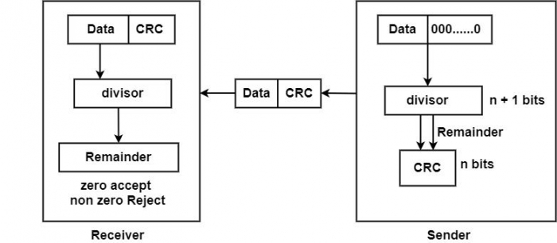

# CRC-Cyclic-Redundancy-Check-
Commonly used in digital networks and storage devices to identify unintentional alterations to digital data. CRC or Cyclic Redundancy Check is a method of detecting accidental changes/errors in the communication channel

# Ilustration  

